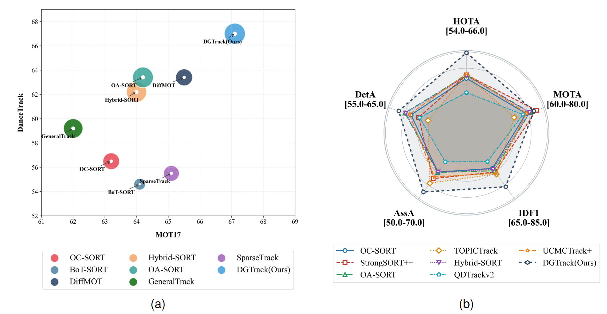
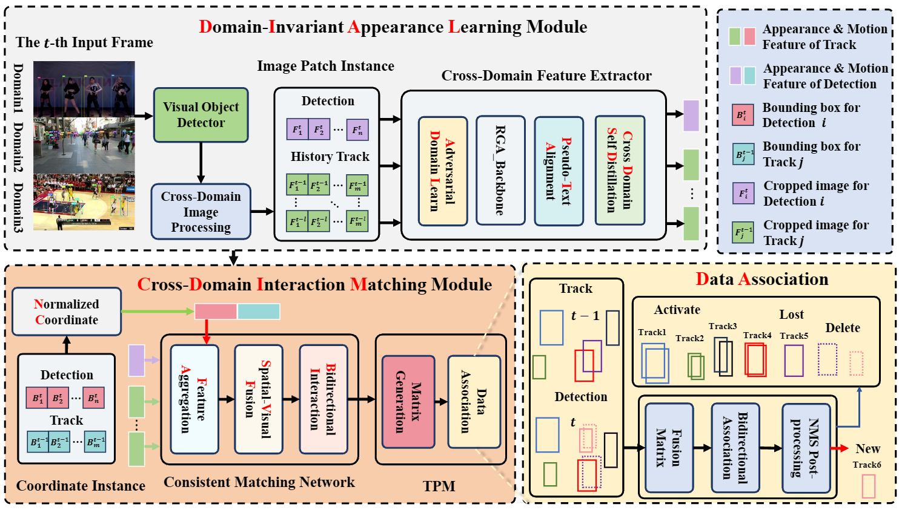
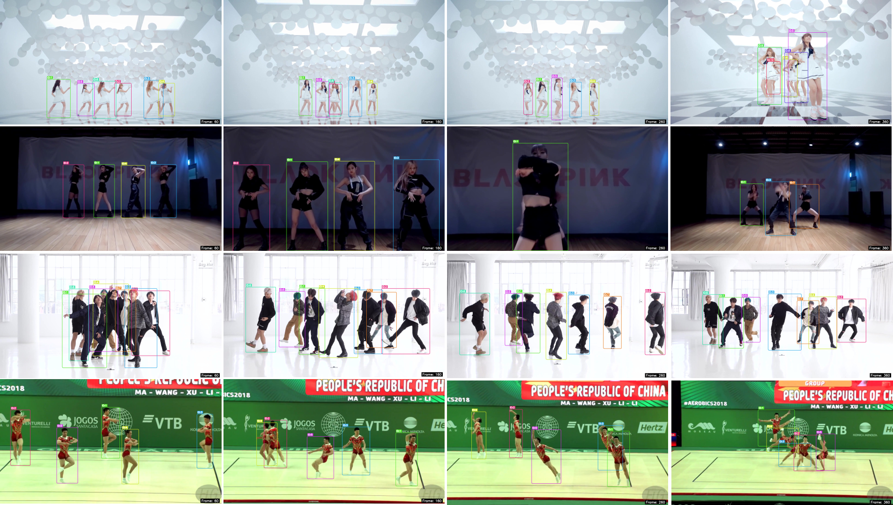
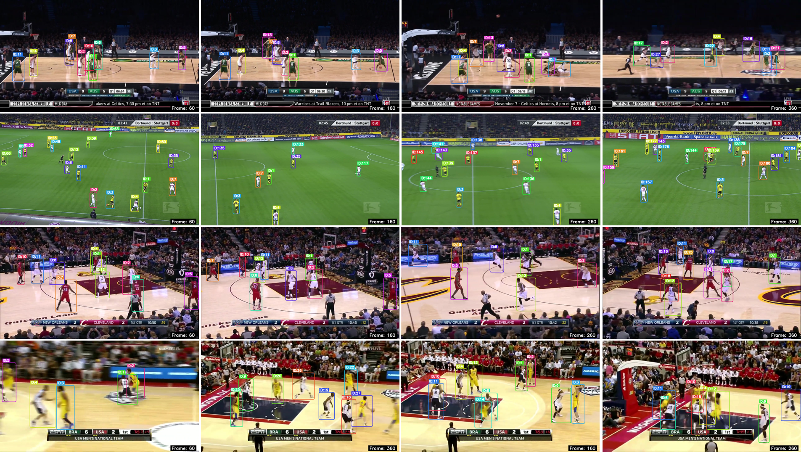
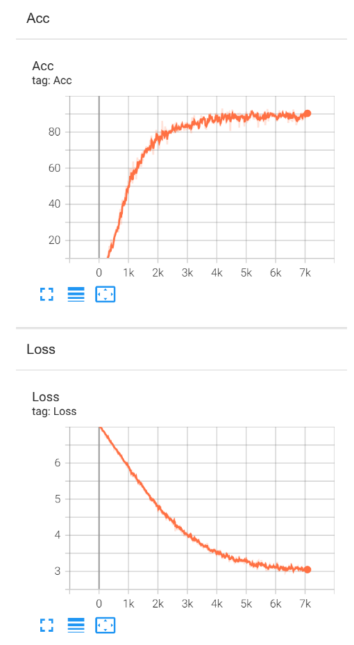

# DGTrack

## DGTrack: Domain-Generalized Unified Association for Multi-Object Tracking

## Abstract

Multi-object tracking (MOT) requires models to maintain reliable identity association across video frames. Under domain shift, source-trained trackers often suffer from appearance representation degradation, which in turn causes unreliable matching between tracklets and detections under the tracking-by-detection paradigm. This highlights a fundamental representation-to-decision bottleneck inherent to structured association tasks: models must learn transferable source-domain features that translate to robust matching decisions on unseen target domains. To address this problem, we propose DGTrack, a source-only unified association framework for domain-generalized MOT. DGTrack consists of two core modules: Domain-Invariant Appearance Learning (DIAL) and Cross-Domain Interaction Matching (CDIM). DIAL learns generalizable appearance features via cross-domain regularization and instance-wise semantic alignment to mitigate domain-induced appearance biases, while CDIM jointly models historical trajectories, spatial geometric priors, and appearance cues to compute robust affinity matrices via bidirectional tracklet-detection interactions. In this way, DGTrack couples transferable representation learning with interaction-aware affinity generation. Extensive experiments on MOT17, DanceTrack, SportsMOT, and the unseen target domain MOT20 show that DGTrack outperforms existing methods in HOTA, IDF1, and AssA without access to target-domain training samples.



### Framework

The overall framework of the proposed DGTrack consists of three core components: the DIAL Module, the CDIM Module, and a Data Association-Based tracking post-processing Module. In the DIAL module, we use a pre-trained Cross-Domain Feature Extractor to extract domain-invariant target appearance representations. In the CDIM module, we build on a pre-trained Consistent Matching Network to learn a fusion of appearance features and spatial location information. And generate a matching matrix between tracklets and detections through a BI mechanism. Finally, in the data association stage, we combine the matching matrix with the tracker state update strategy and post-processing mechanism to achieve stable matching between detections and historical tracklets.



### Results

| Dataset    | HOTA | Assa | IDF1 | MOTA |
| ---------- | ---- | ---- | ---- | ---- |
| Dancetrack | 67.0 | 53.4 | 67.5 | 93.2 |
| SportsMOT  | 75.6 | 64.2 | 75.5 | 96.6 |
| MOT17      | 67.1 | 68.0 | 82.8 | 81.7 |
| MOT20      | 65.9 | 68.1 | 81.5 | 77.5 |


### image demos





## I. Installation

- Install torch

```
conda create -n unifytrack python=3.9.25
conda activate unifytrack
pip install torch==2.3.0 torchvision==0.18.0 torchaudio==2.3.0
```

- Install other packages

```
pip install -r requirement.txt
```

- Install external dependencies.

```
cd external/YOLOX/
pip install -r requirements.txt && python setup.py develop
cd ../reid/
pip install -r requirements.txt
```

## II. Prepare Data

**1. Downlodad datasets**

- MOT17: https://motchallenge.net/data/MOT17.zip
- MOT20: https://motchallenge.net/data/MOT20.zip
- DanceTrack: https://dancetrack.github.io/
- Sportsmot : https://github.com/MCG-NJU/SportsMOT

**2. The file structure should look like:**

- **DanceTrack**

~~~
{data}
|-- Domain1
|   |-- images
|   |   |-- train
|   |   |   |-- dancetrack0001
|   |   |   |   |-- img1
|   |   |   |   ...
|   |   |-- test
|   |   |-- val       
|   |   |   |
|   |   |-- ...
|   |-- labels_with_ids
|   |   |-- ...
|   |-- gt_embeddings
|   |   |-- ...
~~~

- **MOT17**

~~~
{data}
|-- Domain2
|   |-- images
|   |   |-- train
|   |   |   |-- MOT17-02
|   |   |   |   |-- img1
|   |   |   |   ...
|   |   |-- test
|   |   |   |     
|   |   |   |
|   |   |-- ...
|   |-- labels_with_ids
|   |   |-- ...
|   |-- gt_embeddings
|   |   |-- ...
~~~

- **Sportsmot**

~~~
{data}
|-- Domain3
|   |-- images
|   |   |-- train
|   |   |   |-- v_1LwtoLPw2TU_c006
|   |   |   |   |-- img1
|   |   |   |   ...
|   |   |-- test
|   |   |-- val       
|   |   |   |
|   |   |-- ...
|   |-- labels_with_ids
|   |   |-- ...
|   |-- gt_embeddings
|   |   |-- ...
~~~


- **MOT20**

~~~
{data}
|-- MOT20
|   |-- images
|   |   |-- train
|   |   |   |-- MOT20-01
|   |   |   |   |-- img1
|   |   |   |   ...
|   |   |-- test
|   |   |   |       
|   |   |   |
|   |   |-- ...
|   |-- labels_with_ids
|   |   |-- ...
|   |-- gt_embeddings
|   |   |-- ...
~~~


**3.  Into utils and run:**

```
python gen_data_path.py
python gen_json_17.py
python gen_labels_17.py
```

Complete data preparation prior to training and testing


## III. Train Model.

**The file has pre-configured file paths; you need to replace them with your actual local paths.**

### Train the Trackbook


```python
cd Train/
python train_trackbook_mot.py 
```

Show Reuslt:



### Train the DIAL

```python
python train_trackbook_mot_dnn_teacher_self.py
```

The training procedures for other ablation experiments are as follows.

```python
python train_mot.py
python train_trackbook_mot.py
python train_mot_dnn.py
python train_mot_dnn_teacher_self.py
```


### Train the CDIM

Train using the training sets of Domain 1, Domain 2 and Domain 3.

```
cd reid/
python ext_feat_gt.py # Switch between multiple datasets to extract all training information from the three source domains.
cd ../fusion/
python train.py
```

## IV.Tracking

```python
python3 tools/convert_mot17_to_coco.py
python3 tools/convert_dancetrack_to_coco.py
python3 tools/convert_sportsmot_to_coco.py
python3 tools/convert_mot20_to_coco.py
```

**Configure the parameters and file paths for the training, validation and test sets according to your actual selections.**


### Prepare detections

```
cd external/YOLOX/
```

run 

```python
# For MOT17 
python detect_mot17.py  --nms 0.80
python detect_mot17.py  --nms 0.95

# For MOT20 
python detect_mot20.py  --nms 0.80
python detect_mot20.py  --nms 0.95

# For DanceTrack
python detect_dancetrack.py --nms 0.80
python detect_dancetrack.py --nms 0.95

# For Sportmots
python detect_sport.py --nms 0.80
python detect_sport.py --nms 0.95
```


### Prepare Cross-Domain Invariant ReID embeddings

**You shall configure the information of obtained detection results based on the actual file paths generated in the preceding steps.**

```
cd ../../reid/
```

Use the unified model trained for DIAL for processing.

```python
# For MOT17 
python  ext_feat_mot17.py

# For MOT20 
python ext_feat_mot20.py

# For DanceTrack
python ext_feat_dance.py

# For Sportmots
python ext_feat_sport.py
```


**Change the detections_dir, and Cross-Domain Invariant ReID embeddings_dir in config.**


### Track on DanceTrack

```
cd tracker/dgtracker/
python run_dance.py --val
python run_dance.py --test
```


### Track on SportsMOT

```
python run_sport.py --val
python run_sport.py --test
```


### Track on MOT17


```
python mot17.py --val
python mot17.py --test
```


### Track on MOT20

```
python mot20.py --val
python mot20.py --test
```


## Contact

If you have some questions, please concat with us

